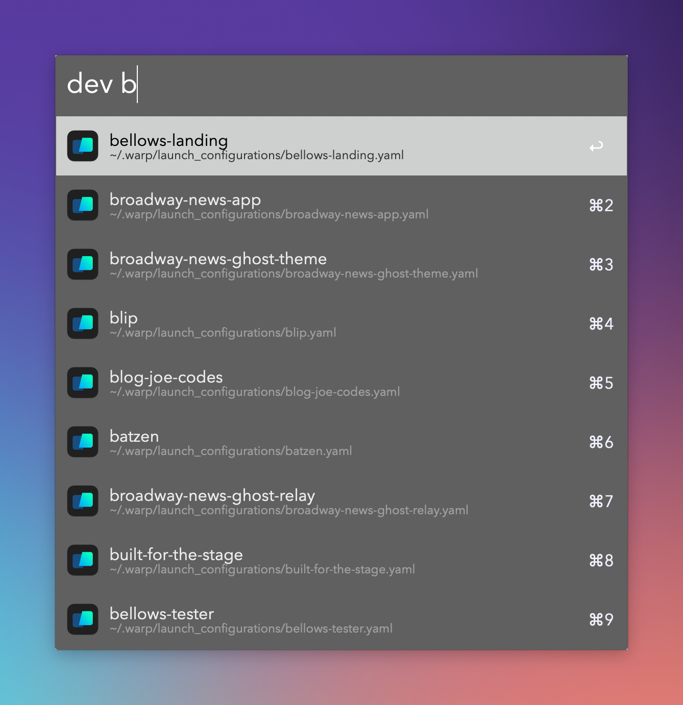

# Alfred Workflow: Warp Launch Configuration

This workflow allows you to open a [Warp](https://warp.dev) [launch configuration](https://docs.warp.dev/features/sessions/launch-configurations) directly from Alfred.

The result is treated as a file within Alfred as well, so you can always open Universal Actions on any result to reveal the file in Finder or open it in your editor.
